<div align="center">



[](https://github.com/miracle-techlink)

&nbsp;


</div>

---

<table align="center" width="88%">
<tr>
<td width="55%" valign="top">

### `> whoami`

```yaml
identity:    miracle-techlink
affiliation:
  - Tongji University (CS)
  - PKU DLIB
  - 智元机器人 (AgiBot)
mission:     Scale VLA for Real-World Robotics
domain:
  - Vision-Language-Action (VLA)
  - Test-Time Training / Scaling
  - Medical Robotics Systems
status:      ██████████████░░  [TRAINING]
```

</td>
<td width="45%" valign="top">

### `> active_ops`

```yaml
primary:
  - VLA training on medical robotics
  - VLA test-time scaling research

learning:
  - Multimodal LLM architectures
  - Embodied world models

collab:
  - MedLab / HealthLab
  - Hospital × Robotics companies

offline:
  - ⚽ Soccer  🏀 Basketball
```

</td>
</tr>
</table>

---

## `📡` STATS UPLINK

<div align="center">

|  |  |
|:---:|:---:|

<br/>

[](https://github.com/miracle-techlink)

</div>

---

## `🏆` ACHIEVEMENT LOG

<div align="center">


</div>

---

## `🧬` TECH GENOME

<table width="88%" align="center">
<tr><td>

**Core Languages**
<p></p>

**AI / ML Stack**
<p></p>

**Infrastructure**
<p></p>

</td></tr>
</table>

---

## `🌐` NEURAL LINK

<div align="center">

[](https://miracle-techlink.github.io)
&nbsp;
[](mailto:2254018@tongji.edu.cn)
&nbsp;
[](mailto:miracle-techlink@gmail.com)

</div>

---

## `🐍` CONTRIBUTION MATRIX

<div align="center">

<picture>
  <source media="(prefers-color-scheme: dark)"  srcset="https://raw.githubusercontent.com/miracle-techlink/miracle-techlink/output/github-contribution-grid-snake-dark.svg">
  <source media="(prefers-color-scheme: light)" srcset="https://raw.githubusercontent.com/miracle-techlink/miracle-techlink/output/github-contribution-grid-snake.svg">
  
</picture>

</div>

<br/>

<div align="center">

</div>
